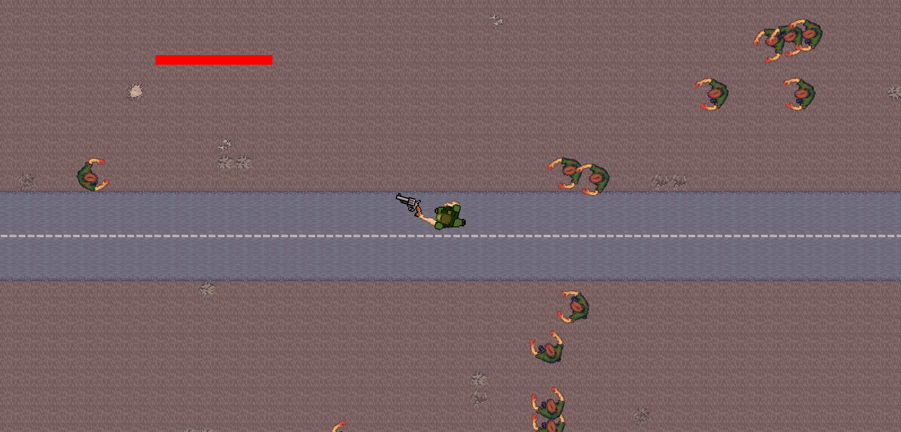
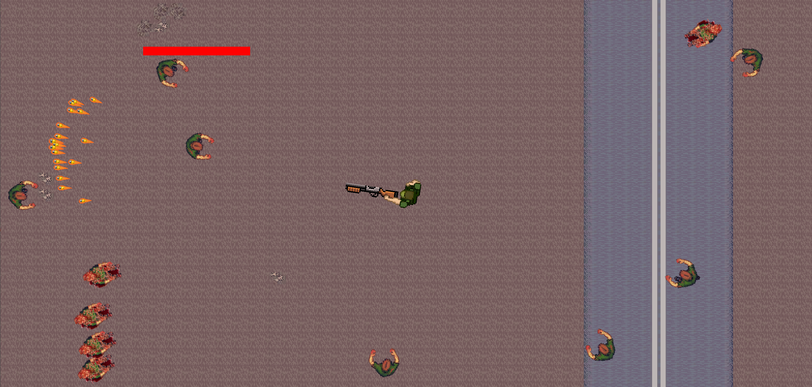

# 🧟 Zombie Survivors

2D шутер на выживание с видом сверху, созданный на Unity.

## 🎮 Геймплей

- Движение - WASD, прицеливание мышью
- Карта - создана с использованием Tilemap
- Оружие - 3 типа с разными паттернами стрельбы:
  - Пистолет - одиночные выстрелы
  - Винтовка - быстрая стрельба
  - Дробовик - разброс пуль
- Смена оружия - колесико мыши
- Эффекты - Particle System для:
  - Вспышки выстрелов
  - Брызги крови при попадании

## 🎯 Управление

- WASD - движение
- Мышь - прицеливание
- ЛКМ - стрельба
- Колесико мыши - смена оружия

## 🚀 Запуск

1. Откройте проект в Unity
2. Загрузите сцену SampleScene
3. Нажмите Play
## Видео и скриншоты

[![Demo Video]](https://youtu.be/mewRn8s2pcM)